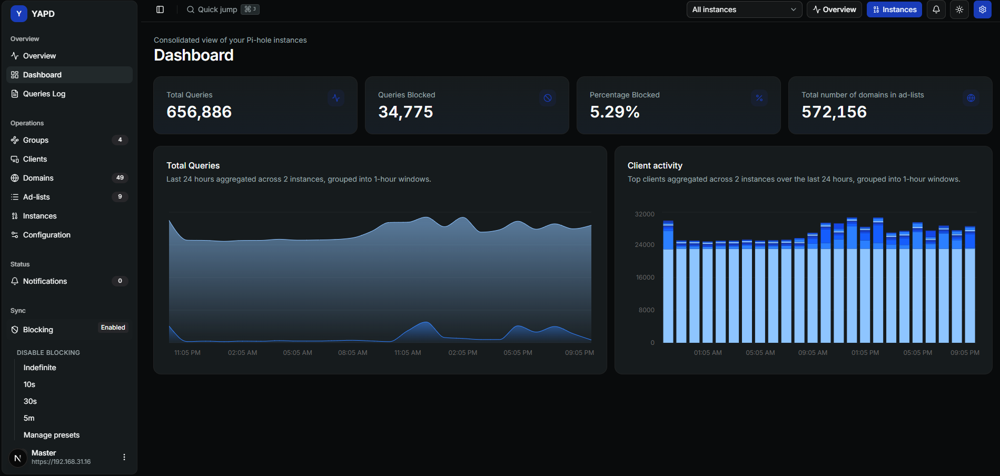

# Welcome to YAPD 👋

YAPD is a self-hosted dashboard for people who run more than one Pi-hole instance and want a clearer, safer way to operate them from one place.

Use these docs to install YAPD, complete the first setup, understand each screen, troubleshoot common errors, and use the special **Overview** screen for historical DNS analysis.


🚧 YAPD is still in active development. Treat it as an early operational tool, especially when using it against production Pi-hole instances.


## Start with these pages 🌱

<table data-view="cards"><thead><tr><th></th><th data-type="content-ref"></th><th data-type="content-ref"></th></tr></thead><tbody><tr><td><h4>🚀 New users</h4></td><td><a href="start-here/what-is-yapd.md">what-is-yapd.md</a></td><td><a href="start-here/first-access-and-setup.md">first-access-and-setup.md</a></td></tr><tr><td><h4>🧭 Daily operation</h4></td><td><a href="daily-use/dashboard.md">dashboard.md</a></td><td><a href="daily-use/overview.md">overview.md</a></td></tr><tr><td><h4>🛠️ Admin setup</h4></td><td><a href="administration/install-with-docker-compose.md">install-with-docker-compose.md</a></td><td><a href="administration/reverse-proxy-and-https.md">reverse-proxy-and-https.md</a></td></tr><tr><td><h4>🧯 Something broke</h4></td><td><a href="troubleshooting/common-problems.md">common-problems.md</a></td><td><a href="troubleshooting/known-issues.md">known-issues.md</a></td></tr></tbody></table>

## What YAPD helps you do ✨

* 👀 See consolidated Pi-hole activity across your instances.
* 🧱 Keep groups, clients, domains, and ad-lists easier to compare and manage.
* 🧭 Choose a global scope or inspect one Pi-hole at a time.
* 🕵️ Review recent queries in **Queries Log**.
* 📊 Import and analyze historical data in **Overview**.
* 🔔 Track operational failures and Pi-hole messages in **Notifications**.
* ⚙️ Review Pi-hole configuration topics and sync selected settings.
* 🧪 Test and reauthenticate instances when credentials, certificates, or network paths change.

## Main screens 🖥️

YAPD's sidebar is organized around **Overview**, **Operations**, and **Status**:

* **Overview** (`/overview`): historical analysis stored in YAPD.
* **Dashboard** (`/dashboard`): live consolidated Pi-hole metrics.
* **Queries Log** (`/queries`): recent DNS activity and quick domain actions.
* **Groups** (`/groups`), **Clients** (`/clients`), **Domains** (`/domains`), **Ad-lists** (`/lists`): Pi-hole objects managed across instances.
* **Instances** (`/instances`): Pi-hole registration, testing, reauthentication, and baseline behavior.
* **Configuration** (`/config`): Pi-hole settings by topic, Teleporter export, drift detection, and sync.
* **Notifications** (`/notifications`): stored events, failures, and push notification controls.
