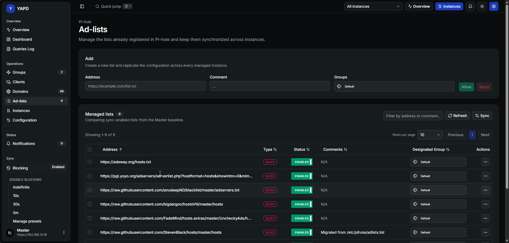

# Ad-lists 🧾

Ad-lists manages the list sources already registered in Pi-hole and helps keep them synchronized across instances.

## What you can do ✅

Use Ad-lists to:

* add block or allow lists;
* search by address or comment;
* enable or disable lists;
* edit comments and groups;
* remove one or more lists;
* review sync status;
* manually sync lists across instances.

## Create a list ➕

When creating a list, provide:

* address;
* comment;
* groups.

YAPD replicates the configuration across managed instances where possible.

## Edit a list ✏️

The edit dialog shows general details and group assignments. Save changes only after confirming the selected groups and status.

## Sync pending 🔁

If a list is missing from one or more instances, YAPD marks it as sync pending. Use the sync dialog to choose the source and destination instances.


⚠️ Removing an ad-list can change filtering behavior for clients assigned to its groups.

