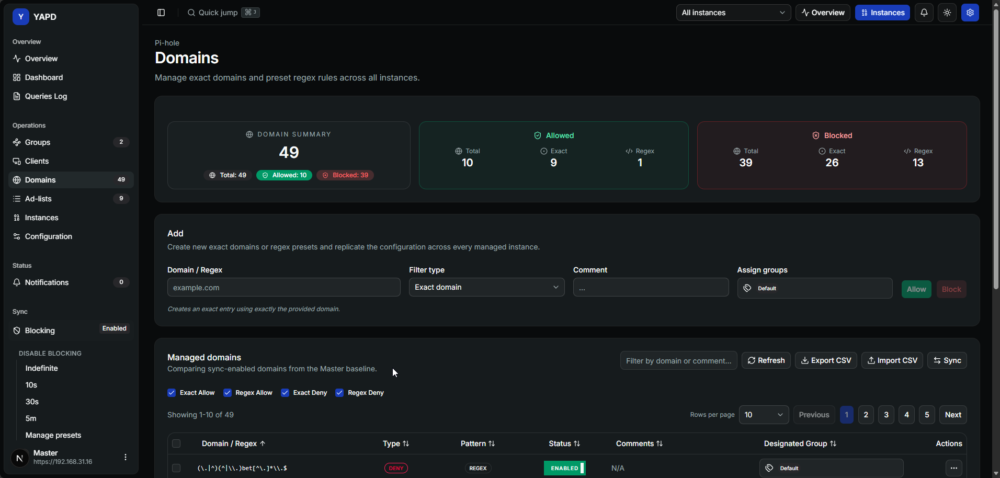

# Domínios 🌐

Domínios permite gerenciar entradas exatas e regras regex pré-definidas entre suas instâncias Pi-hole.

## Tipos de domínio 🧩

O YAPD suporta:

* entradas exatas de allow;
* entradas exatas de block;
* entradas regex de allow;
* entradas regex de block;
* padrões regex pré-definidos para usos comuns.

## Criar um domínio ➕

Ao criar um domínio, escolha:

* texto do domínio ou regex;
* tipo de filtro;
* comentário;
* grupos atribuídos.

O YAPD tenta replicar a nova entrada entre as instâncias gerenciadas.

## Ações da tabela 🛠️

Na tabela você pode:

* pesquisar por domínio ou comentário;
* atualizar a visão;
* sincronizar domínios;
* ativar ou desativar entradas;
* abrir detalhes;
* editar grupos e comentários;
* remover um ou mais domínios;
* exportar ou importar CSV.

## Sync pendente 🔁

Se um domínio existe em algumas instâncias, mas não em outras, use o diálogo de sync para escolher origem e destinos.


⚠️ Remover um domínio remove a entrada de todas as instâncias gerenciadas selecionadas pela operação.

