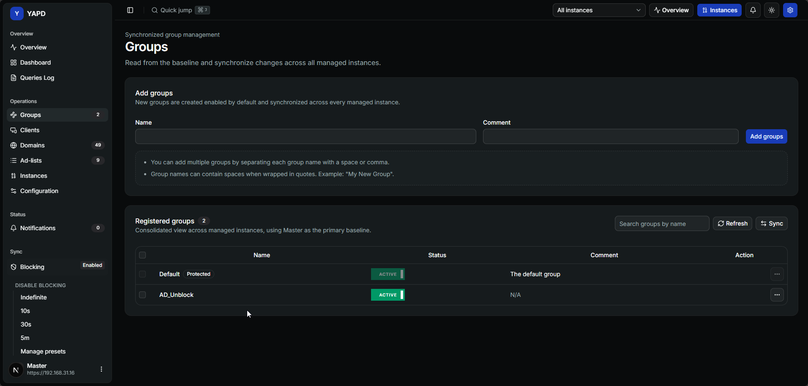

# Groups 👥

Groups is where you manage Pi-hole groups from a consolidated YAPD view.

## What you can do ✅

Use Groups to:

* create one or more groups;
* search registered groups;
* enable or disable groups;
* edit names and comments;
* delete selected groups;
* sync missing groups to target instances;
* view clients linked to a group;
* manage client group membership individually or in bulk.

## Creating groups ➕

New groups are created enabled by default and synchronized across managed instances.

You can create multiple groups by separating names with spaces or commas. Wrap names with spaces in quotes, such as `"Kids Devices"`.

## Sync pending 🔁

If a group exists on some instances but not others, YAPD marks it as sync pending.

Open the sync dialog to choose:

* source instance;
* target instances;
* whether to apply only one group or all pending groups.

## Protected groups 🛡️

YAPD can mark default system groups as protected. Treat those with extra care because Pi-hole may rely on them.

## Linked clients 🔗

Use **View clients** to inspect clients attached to a group, then adjust memberships one by one or in bulk.
