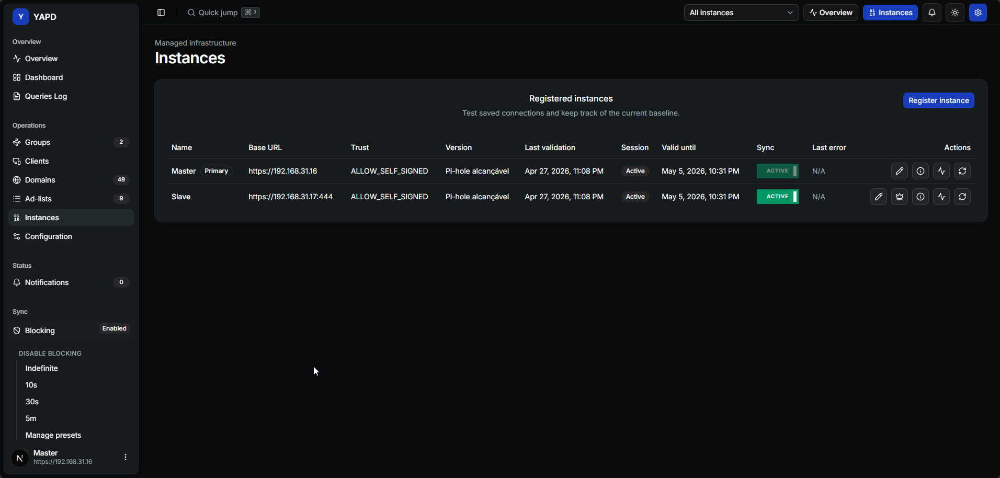

# Instâncias 🧱

Instâncias é onde você gerencia os servidores Pi-hole cadastrados no YAPD.

## O que você pode fazer ✅

Use Instâncias para:

* cadastrar outro Pi-hole;
* descobrir URLs candidatas de Pi-hole;
* testar uma conexão salva;
* reautenticar uma sessão expirada;
* incluir ou excluir uma instância de operações de sync;
* editar configurações de conexão;
* inspecionar informações operacionais;
* tornar outra instância a baseline primária.

## Cadastrar uma instância ➕

Você pode cadastrar uma instância manualmente ou usar descoberta guiada.

No cadastro manual, informe:

* nome;
* protocolo;
* host, porta e caminho opcional;
* senha ou application password;
* escolha de confiança de certificado quando necessário.

## Escolhas de confiança 🔐

| Opção | Quando usar |
| --- | --- |
| Confiança padrão | O certificado do Pi-hole é confiável normalmente. |
| Permitir autoassinado explicitamente | Você confia em um certificado local autoassinado daquele Pi-hole. |
| CA customizada | Você tem um bundle de certificado de CA privada. |

## Reautenticar 🔑

Use **Reauthenticate** quando:

* a sessão do Pi-hole expirou;
* a senha mudou;
* Notificações reportam falha de sessão;
* operações de sync falham porque a instância não está autorizada.

## Tornar primária 👑

Trocar a instância primária atualiza a baseline global do YAPD. A primária anterior perde o status de baseline e o sync permanece habilitado na nova primária.


⚠️ Confirme a nova primária com cuidado. A baseline afeta comparações e vários fluxos de sync.


## Detalhes de erro 🧯

O YAPD classifica falhas comuns de instância:

* credenciais inválidas;
* falha de TLS ou certificado;
* timeout;
* erro de DNS;
* conexão recusada;
* resposta inesperada do Pi-hole;
* falha não classificada.

Abra **Mais detalhes do erro** para ver o que conferir em seguida.
