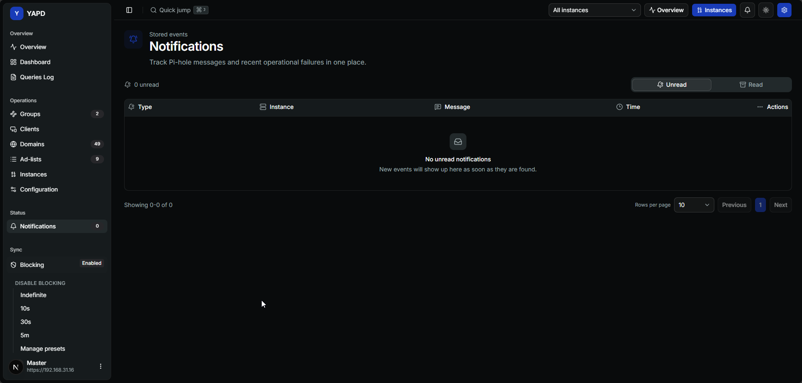

# Notifications 🔔

Notifications centralizes YAPD events, Pi-hole messages, and recent operational failures.

## What appears here 📬

Notifications can include:

* connection errors;
* session failures;
* sync failures;
* Overview import results;
* Overview deletion results;
* Overview coverage renewals;
* collector failures;
* system failures.

## Unread and read tabs 🗂️

Use the tabs to separate active unread events from older read events. You can mark one notification as read or mark all visible notifications as read.

## Clearer failure titles 🧯

YAPD tries to show user-readable failure titles instead of raw technical codes.

Common titles include:

* invalid credentials;
* TLS error;
* connection timeout;
* DNS error;
* connection refused;
* Pi-hole response error.

## Push notifications 📲

Push notifications can be enabled per browser/device when the deployment supports them.

Push requires:

* HTTPS with a trusted certificate, or localhost;
* browser support for push notifications;
* browser permission set to allowed;
* server push configuration available.


🔒 Push usually does not work from plain `http://<server-ip>:48080` access. Use a trusted HTTPS domain through a reverse proxy.

