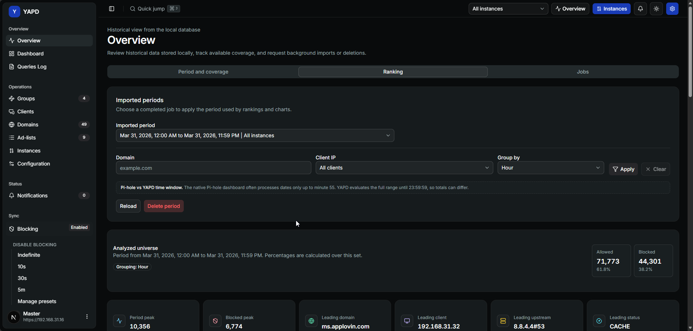

# Overview 📊

Overview is YAPD's historical analysis screen. It reads query history stored in YAPD's local database, then turns that history into coverage, rankings, charts, and background job visibility.

Open it from the sidebar as **Overview** or go directly to `/overview`.

## Why Overview is different 🧠

Dashboard and Queries Log are closer to live Pi-hole activity. Overview is different because it works with imported historical data.

That means:

* you request imports for closed days;
* YAPD stores the historical rows locally;
* rankings and charts use only the stored data;
* background jobs keep running without blocking the screen;
* you can inspect progress, failures, retries, and deletions.


📌 If Overview is empty after a fresh install, that usually means no historical day has been imported yet.


## Tabs in Overview 🧭

Overview has four tabs:

| Tab | Use it for |
| --- | --- |
| **Period and coverage** | Request a manual import, delete a stored period, and review what history is available. |
| **Ranking** | Analyze domains, clients, upstreams, statuses, hourly distribution, and filtered periods. |
| **Jobs** | Follow background imports and deletions, including progress and failures. |
| **Settings** | Create automatic import rules for recurring historical collection. |

The selected tab can also be reflected in the URL, for example `/overview?tab=ranking` or `/overview?tab=jobs`.

## Manual imports 📅

Manual Overview collection accepts one closed day at a time. The default period is the previous closed day from `00:00` to `23:59` in the application time zone.

The current day is blocked because it is still changing.

## Useful links 🔗

* [Period and coverage](overview-period-and-coverage.md)
* [Ranking](overview-ranking.md)
* [Jobs](overview-jobs.md)
* [Overview settings](overview-settings.md)
