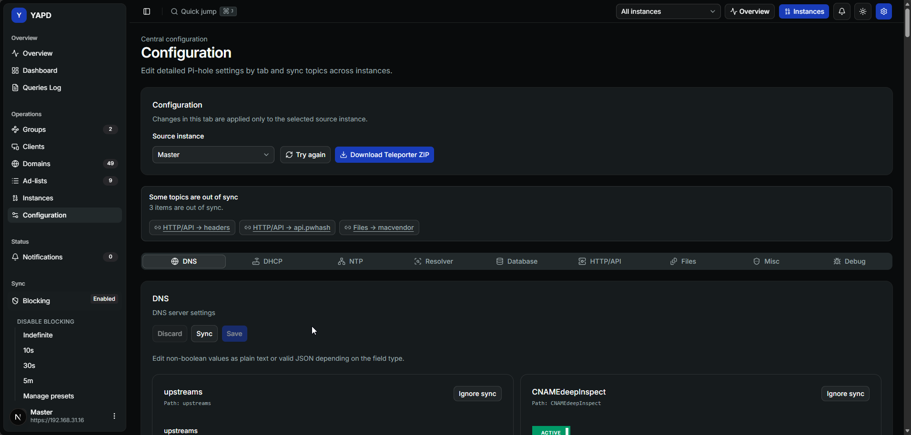

# Pi-hole Configuration ⚙️

Configuration lets you edit detailed Pi-hole settings by topic, detect drift, download a Teleporter ZIP, and sync selected topics across instances.

## Topics 🧭

The Configuration screen is organized into tabs such as:

* DNS;
* DHCP;
* NTP;
* Resolver;
* Database;
* Webserver;
* Files;
* Misc;
* Debug.

## Source instance 🎯

Choose the source instance at the top of the screen. Edits in the active tab are applied to the selected source instance.

## Field editing ✏️

Fields can be:

* boolean toggles;
* text values;
* JSON-like values for structured settings.

YAPD shows helpful metadata such as field path, type, default, allowed values, and flags.

## Drift detection 🧭

If a topic differs between instances, YAPD shows a drift warning. Use the warning links to jump directly to the affected tab and field.

## Ignore sync 🙈

Use **Ignore sync** when a field is intentionally different between instances. Ignored fields are removed from drift warnings until restored.

## Sync a tab 🔁

Use **Sync** inside a topic to copy that tab's configuration from a selected source to selected targets.


⚠️ Configuration sync can change Pi-hole behavior. Review source, targets, and tab before confirming.


## Teleporter ZIP 📦

Use **Download Teleporter ZIP** to download a Pi-hole Teleporter export from the current configuration source.
