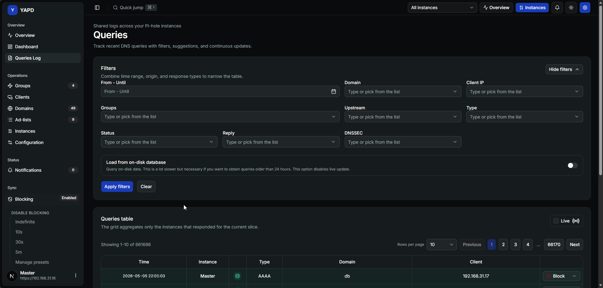

# Queries Log 🔎

Queries Log shows recent DNS queries across your selected YAPD scope, with filters, suggestions, live updates, and quick domain actions.

## What you can filter 🧰

Use filters to narrow the table by:

* time range;
* domain;
* client IP;
* groups;
* upstream;
* type;
* status;
* reply;
* DNSSEC;
* on-disk database mode.

The date filters use the application time zone.

## Live mode ⚡

Live mode refreshes the query table every few seconds. Turn live mode off when you want to navigate pages calmly.

## On-disk mode 💿

Use **Load from on-disk database** when you need older Pi-hole data.


🐢 On-disk mode is slower and disables live updates.


## Quick domain actions 🛠️

From the query table, you can use domain actions such as:

* block a domain;
* block by regex;
* allow a domain.

YAPD applies the action to available instances and reports partial failures when some instances cannot be updated.

## Group review warning 🧭

If YAPD warns that group review is needed, open **Groups**. This keeps group-based query filters accurate across instances.
